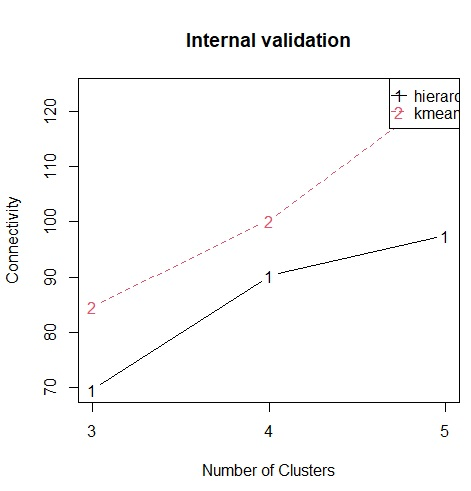

# Análise de Cluster Gir leiteiro
Análise e validação de clusters realizada para visualizar a presença de animais de mérito genético distribuídos pela amostra.

Esse repositório contém o código utilizado na realização do meu TCC do MBA em Data Science & Analytics da USP/ESALQ.

Meu objetivo foi o de encontrar animais presentes na tabela que fossem iguais entre si, independente da posição original adotada no sumário utilizado.

Agrupamento de reprodutores do Gir Leiteiro baseado na análise de clusters 

## Resumo do artigo:

O objetivo do presente 
trabalho foi o de realizar um 
agrupamento com os dados da 
4a avaliação genômica de 
touros do programa nacional de melhoramento do Gir leiteiro, separando os animais em grupos cujos representantes sejam o mais semelhante possível quando comparados dentro do mesmo grupo e o mais distintos quanto possível, quando comparados com os animais de outros grupos, utilizando de técnicas de análise de agrupamento e clusterização. Foram utilizados apenas os animais com valores conhecidos de PTA's (que são as habilidades preditas de transmissão (PTA's) para as características: produção total de leite (PTAL), produção de gordura (PTAG), porcentagem de gordura (PTA%G), produção de proteína (PTAP), porcentagem de proteína (PTA%P), produção de sólidos totais (PTAST) e porcentagem de sólidos totais (PTA%ST)). Com a padronização dessas características, o agrupamento foi realizado pelo método hierárquico para obtenção de um dendrograma através do método de Ward. Os cálculos realizados foram essenciais na criação de um dendrograma que separou inicialmente a amostra de 278 animais em 3 grupos. Posteriormente foi utilizado o pacote clValid para validar essa separação, utilizando os valores do coeficiente de silhueta, valor de conectividade e índice de Dunn para definir o número ótimo de clusters e comparar com o obtido inicialmente. O uso do pacote validou a escolha inicial de separação em 3 grupos, que posteriormente foram mostrados sobre a ordem do sumário original para comparação, mostrando que um animal estar próximo do outro no ranking original nem sempre significava uma maior semelhança. Isso foi essencial para concluir que a aplicação do método melhoraria a análise de um sumário de touros, enquanto ajudando na tomada de decisão do analista.

Palavras-chave: Análise de clusters; método de Ward; clValid; PTA’s; Sumário de touros Gir.

### Para reproduzir o código: 

Utilizando o R Studio abra o R Project de título TCC.Rproj

Abaixo se encontra um exemplo de um dos gráficos utilizados na decisão do número de clusters adotados com o pacote clValid.

### Conteúdo do repositório:

Código utilizado

Tabelas

Instalação de scripts

